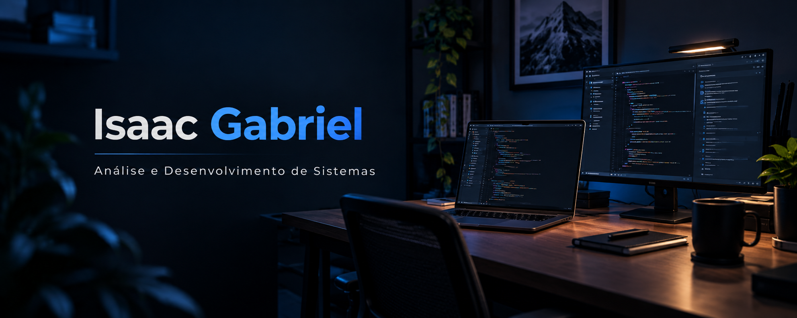

## 👨🏻‍💻 Sobre mim

Tenho interesse em desenvolvimento de software e busco minha primeira oportunidade profissional na área de tecnologia.

Durante a graduação, tive contato com fundamentos de programação, desenvolvimento web, APIs, bancos de dados e versionamento de código, além de atividades acadêmicas envolvendo o desenvolvimento de aplicações.

Minha experiência profissional anterior nas áreas administrativa e financeira também contribuiu para desenvolver organização, responsabilidade e capacidade analítica.

---

## 🛠️ Conhecimentos

- Lógica e fundamentos de programação;
- APIs REST e operações CRUD;
- Fundamentos de bancos de dados.

### Tecnologias com as quais tive contato

  

---

## 💼 Experiência profissional

Experiência nas áreas administrativa e financeira, com atuação em rotinas de controle, organização de processos e documentos, elaboração de planilhas e utilização de sistemas corporativos.

---

## 🎓 Formação

**Tecnólogo em Análise e Desenvolvimento de Sistemas**  
UNINASSAU — Conclusão prevista: dez/2026

---

## 📫 Contato

  
  

